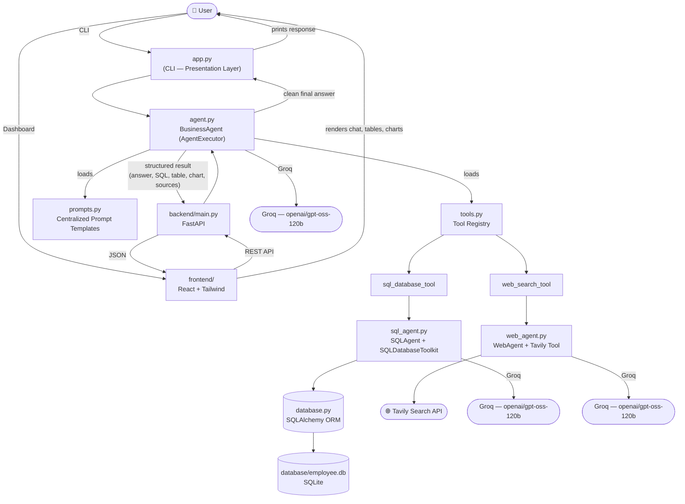

# AI Business Research Agent

> An autonomous, tool-using AI agent that answers business questions by intelligently routing between an internal SQL database and live web search — built with LangChain, Groq, Tavily, FastAPI, and React.


---

## 📖 Project Overview

**AI Business Research Agent** is a portfolio-grade, production-style AI agent that acts as a single point of contact for business questions — whether the answer lives in your company's internal database or out on the open web.

Instead of forcing the user to pick a data source, the agent **automatically decides** which tool (or tools) to use based on the nature of the question:

- Ask *"What is our average employee salary?"* → it queries the internal SQL database.
- Ask *"What are the latest trends in the AI chip market?"* → it searches the web.
- Ask *"How does our revenue compare to industry growth this year?"* → it does **both**, then synthesizes a single, coherent answer.

No manual routing. No dropdowns. No "please select a data source." Just a conversation.

The project is built with **clean architecture** principles — clear separation between presentation, orchestration, tool adapters, and infrastructure — making it easy to extend, test, and maintain.

---

## ✨ Features

- 🤖 **Autonomous tool routing** — the agent decides for itself whether a question needs internal data, web search, both, or neither.
- 🗃️ **Natural-language SQL querying** — ask business questions in plain English; the agent generates and safely executes read-only SQL against a SQLite database.
- 🌐 **Live web research** — powered by Tavily Search, with results summarized (never dumped raw) by Groq.
- 💬 **Multi-turn conversation** — both the orchestrator and the web research sub-agent retain conversation history, so natural follow-up questions work out of the box.
- 📊 **Web dashboard** — a full React + FastAPI dashboard with a chat interface, sidebar session history (Chat / SQL / Research / Saved Reports), data tables, auto-generated charts, and CSV/Excel/JSON export — in addition to the CLI.
- 📈 **Auto-generated charts** — chart-friendly SQL results (e.g. "sales by product") are automatically rendered as bar/pie/line charts in the dashboard.
- 📥 **Data export** — SQL result tables can be exported as CSV, Excel, or JSON directly from the dashboard.
- 🔒 **Safety guardrails** — the SQL agent is explicitly restricted to read-only queries (no `INSERT`/`UPDATE`/`DELETE`/`DROP`/`ALTER`).
- 🧱 **Clean architecture** — presentation, orchestration, tools, and infrastructure are cleanly separated across dedicated modules.
- 🧪 **Auto-seeding sample database** — running the app for the first time automatically creates and populates a realistic SQLite database (employees, departments, products, customers, orders).
- 🖥️ **CLI included** — no setup beyond an API key; chat with the agent directly from your terminal if you don't need the dashboard.

---

## 🏗️ Architecture Diagram



**How a request flows:**
1. The user asks a question either via the CLI (`app.py`) or the dashboard (`frontend/` → `backend/main.py`).
2. `agent.py`'s `BusinessAgent` receives it and — guided entirely by the system prompt in `prompts.py` — decides which tool(s) to call.
3. `tools.py` exposes two tools: `sql_database_tool` (backed by `sql_agent.py`) and `web_search_tool` (backed by `web_agent.py`).
4. The SQL agent queries `database/employee.db` via SQLAlchemy; the web agent queries the internet via Tavily.
5. Groq synthesizes a single, clean, natural-language answer.
6. The CLI prints plain text. The dashboard instead receives a **structured result** (`schemas.ToolExecutionResult`) — the answer plus which tool ran, execution time, generated SQL, table rows, an auto-suggested chart, and web sources — which the React frontend renders as a rich chat message, complete with data tables, charts, and export buttons.

---

## ⚙️ Installation

### Prerequisites
- Python 3.10+
- Node.js 18+ (only needed for the dashboard's React frontend)
- A [GroqCloud](https://console.groq.com/keys) API key (for the LLM)
- A [Tavily](https://tavily.com/) API key (for web search)

### Steps

```bash
# 1. Clone the repository
git clone https://github.com/<your-username>/ai-business-agent.git
cd ai-business-agent

# 2. Create and activate a virtual environment
python3 -m venv venv
source venv/bin/activate      # On Windows: venv\Scripts\activate

# 3. Install Python dependencies (CLI + agents + FastAPI backend)
pip install -r requirements.txt

# 4. Configure environment variables
cp .env.example .env
# Then open .env and add your keys:
#   GROQ_API_KEY=your_groq_api_key_here
#   TAVILY_API_KEY=your_tavily_api_key_here

# 5. (Dashboard only) Install frontend dependencies
cd frontend
npm install
cd ..
```

> 💡 The SQLite database (`database/employee.db`) is created and seeded with realistic sample data **automatically** the first time the agent runs — no manual setup required.

---

## 🚀 Usage

### Option A: Web Dashboard (recommended)

The dashboard needs two processes running at once — the FastAPI backend and the React frontend.

```bash
# Terminal 1 — start the backend API (from the project root)
uvicorn backend.main:app --reload --port 8000

# Terminal 2 — start the frontend dev server
cd frontend
npm run dev
```

Then open **http://localhost:5173** in your browser. The frontend's dev server proxies all `/api/*` requests to the backend automatically (see `frontend/vite.config.js`), so no extra configuration is needed.

From the home page, either type a question into "Ask Anything..." or click one of the example prompts. Every answer shows which tool was used, how long it took, and — depending on the question — a data table with export buttons, an auto-generated chart, or a list of web sources with links.

### Option B: CLI

```bash
python app.py
```

#### Example CLI session

```
==================================================
  AI Business Research Agent
==================================================
Ask me about internal business data (employees,
salaries, revenue, product sales, etc.) or general
business/web research questions.

Type 'exit' to quit.
==================================================

Agent is ready. How can I help you?

You: How many employees do we have, and what's the average salary?
Agent: We currently have 30 employees, with an average salary of approximately $94,500.

You: What are the latest trends in the AI chip market?
Agent: The AI chip market continues to see strong demand driven by generative AI
workloads, with increased competition in custom silicon and edge inference chips...

You: How does our headcount compare to typical industry staffing levels?
Agent: Based on internal data, we have 30 employees across 7 departments. Compared to
industry benchmarks for similarly sized companies, this is roughly in line with
typical staffing ratios for a growing mid-size business...

You: exit
Goodbye!
```

### Running individual components

Each module can also be run standalone for testing:

```bash
python database.py     # Initialize / inspect the sample database
python sql_agent.py     # Run demo SQL questions
python web_agent.py     # Run demo web research questions
python tools.py          # List registered tools and run a sample call through each
python agent.py           # Run demo end-to-end orchestrator questions
```

The backend also exposes interactive API docs (Swagger UI) once running, at **http://localhost:8000/docs** — useful for testing endpoints like `/api/chat` and `/api/export/{format}` directly.

---

## 🖼️ Screenshots

> _Add screenshots here to showcase the dashboard and CLI in action._

| Dashboard — Chat + SQL Table | Dashboard — Chart | Dashboard — Web Research |
|---|---|---|
|  |  |  |

| CLI in action | Multi-turn conversation |
|---|---|
|  |  |

---

## 🧰 Tech Stack

| Layer | Technology |
|---|---|
| Language (backend) | Python 3.10+ |
| Agent framework | [LangChain](https://www.langchain.com/) (`langchain`, `langchain-core`, `langchain-community`, `langchain-experimental`) |
| LLM | Groq (`openai/gpt-oss-120b`) via `langchain-groq` |
| Web search | [Tavily Search API](https://tavily.com/) via `tavily-python` |
| Database | SQLite |
| ORM | SQLAlchemy |
| Backend API | [FastAPI](https://fastapi.tiangolo.com/) + [Uvicorn](https://www.uvicorn.org/) |
| Data export | `pandas` + `openpyxl` (CSV / Excel / JSON) |
| Frontend | [React](https://react.dev/) 19 + [Vite](https://vite.dev/) |
| Styling | [Tailwind CSS](https://tailwindcss.com/) v4 |
| Charts | [Recharts](https://recharts.org/) |
| Frontend routing | React Router |
| Config management | `python-dotenv` |
| Interfaces | Web dashboard (React) + Command-line (CLI) |

---

## 📁 Folder Structure

```
ai-business-agent/
│
├── app.py                 # CLI entry point (presentation layer)
├── agent.py                # Orchestrator agent — automatic tool routing (AgentExecutor)
├── sql_agent.py            # SQL sub-agent — natural language → SQL via SQLDatabaseToolkit
├── web_agent.py             # Web research sub-agent — Tavily search + Groq summarization
├── database.py              # SQLAlchemy models, DB initialization & sample data seeding
├── prompts.py               # Centralized prompt templates for all agents
├── tools.py                  # LangChain Tool registry (SQL Tool + Web Search Tool)
├── schemas.py                 # Shared ToolExecutionResult / ChartSpec dataclasses
├── config.py                  # Environment / configuration loading
├── requirements.txt
├── .env.example
├── .gitignore
├── README.md
│
├── database/
│   └── employee.db         # Auto-generated SQLite database (Employees, Departments,
│                             #   Products, Customers, Orders)
│
├── utils/                    # Shared helper utilities
│   ├── __init__.py
│   └── output_parsing.py     # Normalizes LLM output shapes into plain strings
│
├── backend/                   # FastAPI web layer for the dashboard
│   ├── main.py                 # API app: /api/chat, /api/sessions, /api/export/{format}
│   ├── api_models.py            # Pydantic request/response models
│   ├── session_store.py          # In-memory chat session storage
│   └── export_utils.py            # CSV / Excel / JSON export helpers
│
└── frontend/                  # React + Vite + Tailwind dashboard
    ├── package.json
    ├── vite.config.js           # Dev server + API proxy to the FastAPI backend
    └── src/
        ├── App.jsx                # Routing + layout (Sidebar, TopBar, HomeView/ChatView)
        ├── index.css               # Tailwind v4 theme tokens (the color palette)
        ├── lib/
        │   └── api.js                # Fetch wrapper for the backend API
        └── components/
            ├── Sidebar.jsx            # Chat/SQL/Research history + Saved Reports
            ├── TopBar.jsx              # Header bar
            ├── HomeView.jsx            # "Ask Anything" + example prompts
            ├── ChatView.jsx            # Chat message list + input
            ├── ChatMessage.jsx         # AI response card (tool badge, timing, SQL)
            ├── SqlResultTable.jsx      # Data table + Export CSV/Excel/JSON
            ├── WebResearchCard.jsx     # Bulleted answer + sources list
            └── ChartRenderer.jsx       # Auto-generated bar/pie/line charts
```

---

## 🔭 Future Improvements

- [ ] Centralize all configuration (API keys, model names, constants) fully into `config.py`
- [ ] Replace in-memory session storage (`backend/session_store.py`) with a persistent store (e.g. a `sessions` table in the existing SQLite database, or Redis)
- [ ] Support true concurrent multi-user sessions (currently one shared agent instance resyncs its memory per session — see the design note in `backend/main.py`)
- [ ] Add automated tests (`pytest`) covering tool routing accuracy across SQL / Web / Mixed / Ambiguous question sets
- [ ] Add support for exporting agent answers to PDF/Word reports
- [ ] Add authentication and role-based access control for the dashboard
- [ ] Add streaming responses (token-by-token) for a more responsive chat experience
- [ ] Add observability (LangSmith tracing) for debugging tool-selection decisions
- [ ] Support additional LLM providers (e.g. OpenAI, Anthropic) as configurable alternatives to Groq
- [ ] Expand auto-chart heuristics beyond simple two-column bar charts (e.g. detect date columns for line charts, categorical shares for pie charts)

---

## 📄 License

This project is licensed under the [MIT License](LICENSE).

---

<p align="center">Built with LangChain, Groq, Tavily, FastAPI, and React.</p>
